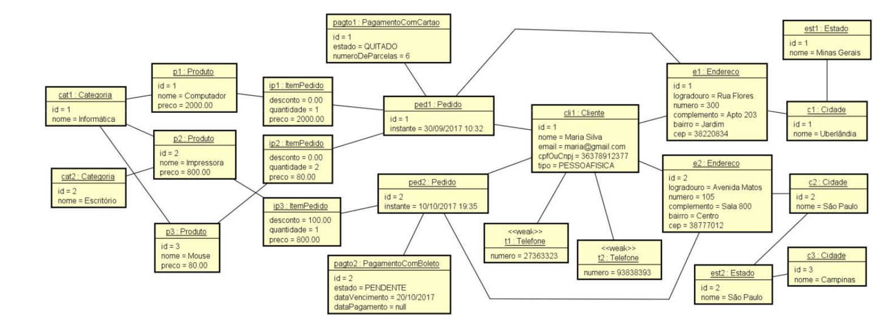

# java-uml-api

## How to Run

1. Certify you have this or above Java version:
```bash
openjdk 19.0.2 2023-01-17
OpenJDK Runtime Environment (build 19.0.2+7-Ubuntu-0ubuntu322.04)
OpenJDK 64-Bit Server VM (build 19.0.2+7-Ubuntu-0ubuntu322.04, mixed mode, sharing)
```

2. Clone this Repository
```shell
git clone https://github.com/guimassoqueto/java-uml-api.git
```

3. Run the `StoreapiApplication.java` located in `src/java/com/guimassoqueto/storeapi/storeapi`

### Application UML Class Diagram


### UML Object Diagram (instantiated)


### API Endpoints
|      Endpoint      |                           Are                            |
|--------------------|:--------------------------------------------------------:|
| `/categories/{id}` |               Categories and its products                |
| `/clientes/{id}`   |        Client, Client's phone and Client's Address       |
| `/pedidos/{id}`    | Client's Order, Payment, Order's items, Delivery Address |
| `/h2-console`      |                     H2 Test Database                     |
