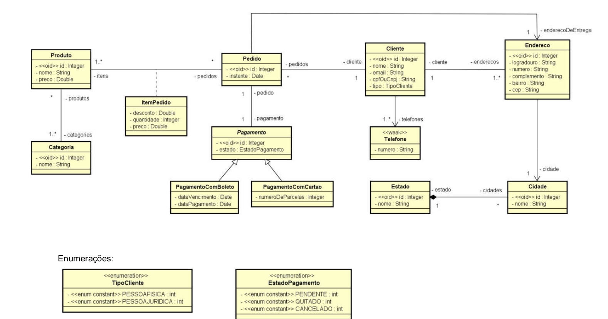

# java-uml-api

### Application UML Class Diagram

### UML Object Diagram (instantiated)

### API Endpoints
|      Endpoint      |                           Are                            |
|--------------------|:--------------------------------------------------------:|
| `/categories/{id}` |               Categories and its products                |
| `/clientes/{id}`   |        Client, Client's phone and Client's Address       |
| `/pedidos/{id}`    | Client's Order, Payment, Order's items, Delivery Address |
